  

# Hi everybody :)
This is a collection of JSX scripts for Adobe Illustrator. All scripts created by me, sometimes used part of the code of other authors.  

The descriptions for each file can be found in the file's header text. Test environment: Illustrator CS6, CC 2020 (Windows), CC 2019, 2020 (Mac OS).   

### Alphabetical list of scripts
* [ArtboardsRotateWithObjects.jsx]   
* [ConvertToGradient.jsx]   
* [DuplicateArtboardsLight.jsx] `(new, 21.10.2020)`  
* [Export-selection-as-AI.jsx]   
* [ExtUngroup.jsx] `(upd, 25.11.2019)`   
* [FileVersionInformer.jsx]   
* [InlineSVGToAI.jsx]   
* [PointsMoveRandom.jsx] `(new, 08.05.2020)`  
* [RenameItems.jsx] `(upd, 23.07.2020)`
* [Rescale.jsx] `(upd, 25.03.2020)`
* [ResizeToSize.jsx] `(upd, 17.04.2020)`
* [SelectOnlyPoints.jsx] `(upd, 29.11.2019)`  
* [SelectPointsByType.jsx] `(upd, 05.08.2020)`   
* [SplitPath.jsx] `(upd, 30.08.2020)`    
* [StrokeColorFromFill.jsx] `(new, 14.08.2020)`   
* [TrimMasks.jsx] `(upd, 14.10.2020)`
* [Zoom-and-center.jsx] 

[ArtboardsRotateWithObjects.jsx]: https://github.com/creold/illustrator-scripts#artboardsrotatewithobjects-12
[ConvertToGradient.jsx]: https://github.com/creold/illustrator-scripts#converttogradient
[DuplicateArtboardsLight.jsx]: https://github.com/creold/illustrator-scripts#duplicateartboardslight
[Export-selection-as-AI.jsx]: https://github.com/creold/illustrator-scripts#export-selection-as-ai 
[ExtUngroup.jsx]: https://github.com/creold/illustrator-scripts#extungroup-v12
[FileVersionInformer.jsx]: https://github.com/creold/illustrator-scripts#fileversioninformer
[InlineSVGToAI.jsx]: https://github.com/creold/illustrator-scripts#inlinesvgtoai
[PointsMoveRandom.jsx]: https://github.com/creold/illustrator-scripts#points-move-random
[RenameItems.jsx]: https://github.com/creold/illustrator-scripts#renameitems
[Rescale.jsx]: https://github.com/creold/illustrator-scripts#rescale
[ResizeToSize.jsx]: https://github.com/creold/illustrator-scripts#resizetosize
[SelectOnlyPoints.jsx]: https://github.com/creold/illustrator-scripts#selectonlypoints
[SelectPointsByType.jsx]: https://github.com/creold/illustrator-scripts#selectpointsbytype
[SplitPath.jsx]: https://github.com/creold/illustrator-scripts#splitpath
[StrokeColorFromFill.jsx]: https://github.com/creold/illustrator-scripts#strokecolorfromfill
[TrimMasks.jsx]: https://github.com/creold/illustrator-scripts#trimmasks
[Zoom-and-center.jsx]: https://github.com/creold/illustrator-scripts#zoom-and-center

### How to run scripts

#### Variant 1 — Install 

1. [Download archive] and unzip. All scripts are in the folder `jsx`
2. Place `<script_name>.jsx` in the Illustrator Scripts folder:
	- OS X: `/Applications/Adobe Illustrator [vers.]/Presets.localized/en_GB/Scripts`
	- Windows (32 bit): `C:\Program Files (x86)\Adobe\Adobe Illustrator [vers.]\Presets\en_GB\Scripts\`
	- Windows (64 bit): `C:\Program Files\Adobe\Adobe Illustrator [vers.] (64 Bit)\Presets\en_GB\Scripts\`
3. Restart Illustrator

[Download archive]: http://bit.ly/2M0j95N 

#### Variant 2 — Drag & Drop
Drag and drop the script file (JS or JSX) into Adobe Illustrator Window

#### Variant 3 — Use extension
I recommend the [Scripshon Trees] panel. In it you can specify which folder your script files are stored in.

[Scripshon Trees]: https://exchange.adobe.com/creativecloud.details.15873.scripshon-trees.html

### Donate (optional)
If you find this script helpful, you can buy me a coffee ☕️ via [PayPal] or [Yandex Money] 🙂  

[PayPal]: https://paypal.me/osokin/2usd
[Yandex Money]: https://money.yandex.ru/to/410011149615582
  

## ArtboardsRotateWithObjects 1.2

Script to rotate 90 degrees an document artboards with all the objects on it.   
*Author: [Alexander Ladygin](http://ladygin.pro/). UI: Sergey Osokin.*

### Usage

1. Open your file
2. Run script `File → Scripts → ArtboardsRotateWithObjects`
3. Select the options in the dialog box & click `Ok` button

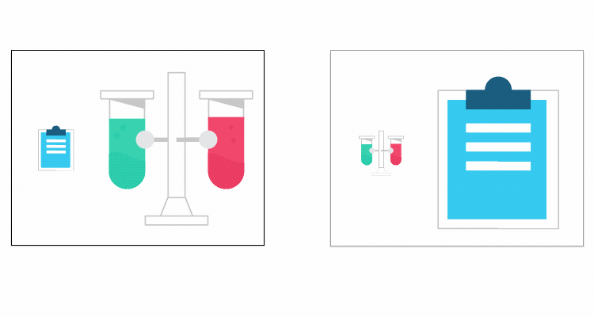 

 

## ConvertToGradient

Convert a flat process color into a matching gradient.   
What's new: The script now works with the RGB and CMYK document profile, Spot & Gray colors. Processes compound paths and groups of items.   
*Based on original script by [Saurabh Sharma](https://tutsplus.com/authors/saurabh-sharma), 2010.*   

### Usage

1. Select objects
2. Run script `File → Scripts → ConvertToGradient`
3. Enter a numeric values in input fields

 

 

## DuplicateArtboardsLight

Script for copying the selected Artboard with his artwork. The Pro version with more options is available at [Gumroad](https://gumroad.com/sergosokin)   

### Usage

1. Run script `File → Scripts → DuplicateArtboardsLight `
2. Enter a numeric values in input fields

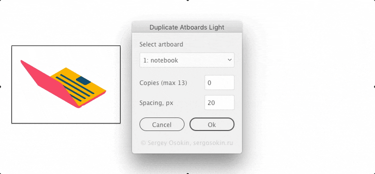 

 

## Export selection as AI
Exports all selected objects to AI files.    
*Based on Layers to SVG 0.1 by Anton Ball.*

### Usage

1. Select objects
2. Run script `File → Scripts → Export-selection-as-AI`
3. Select options in dialog box
 

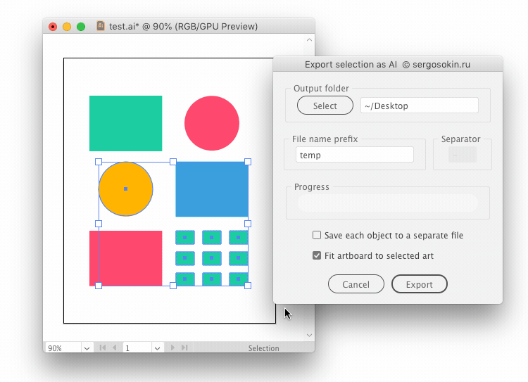 

 

## ExtUngroup v.1.2
This script is сan be easily custom ungrouping to all group items & releasing clipping masks in the document.   
*Based on original script by Jiwoong Song & modification by [John Wundes](http://www.wundes.com/).*

### Usage

1. Select object(s) to ungroup or deselect all
2. Run script `File → Scripts → ExtUngroup`
3. Select options in dialog box
 

 

 

## FileVersionInformer

Script for collecting information about the program version of .ai & .eps files in selected folder & subfolder.   
*Notice: on large files it works slowly, just wait.*

### Usage

1. Run script `File → Scripts → FileVersionInformer`
2. Choose folder with .ai or .eps files
3. Wait for the completion message
4. Look "FileVersionInformer.txt" in source folder
 

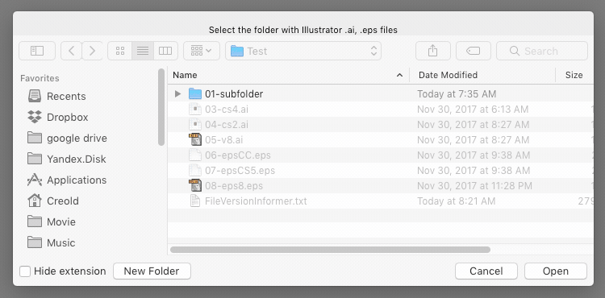 

 

## InlineSVGToAI

The script inserts the SVG code as an object from the clipboard into the Adobe Illustrator CC 2014+. Adobe Illustrator CC 2018 v.22.1 (march, 2018) can insert SVG graphics without a script.   
*Author: [Alexander Ladygin](http://ladygin.pro/). Code refactoring: Sergey Osokin.*

### Usage

1. Run script `File → Scripts → InlineSVGToAI`
2. Paste your svg code in textarea
3. Press button "Paste"

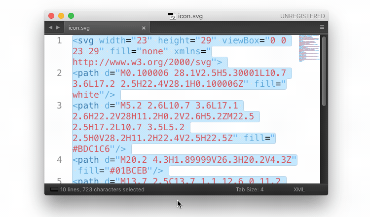 

 

## Points Move Random

The script moves randomly in numeric ranges horizontally and vertically selected points or all points on objects.   

### Usage

1. Run script `File → Scripts → PointsMoveRandom`
2. Enter number values
3. Choose options
4. Press button "Apply" or Alt+A

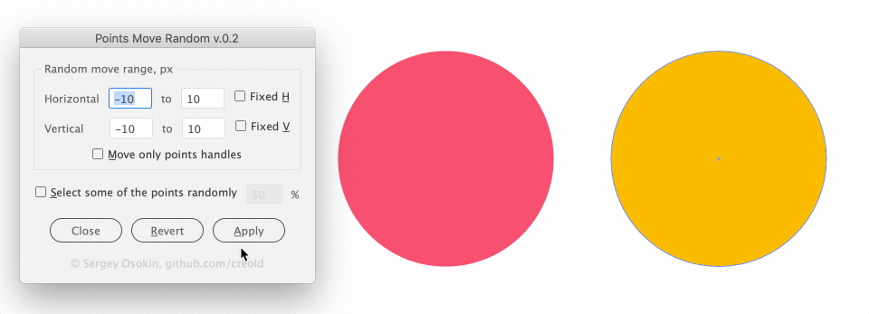 

 

## RenameItems

Script to batch rename selected items with many options or simple rename one selected item / active layer.      

### Usage

1. Run script `File → Scripts → RenameItems`
2. Enter name
3. Choose options

 

 

## Rescale

Automatic scaling of objects to the desired size. If you draw a line on top with the length or height of the desired object, 'Old Size' will be filled automatically. Units associated with "Document Setup".      

### Usage

1. Run script `File → Scripts → Rescale`
2. Enter numeric values
3. Press button "OK" 

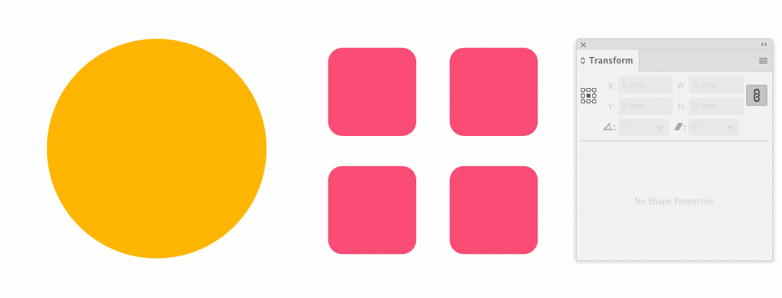 

 

## ResizeToSize

Adobe Illustrator has a Transform panel, but you cannot use it to transform several selected objects to a specified value. It also has problems with the accuracy of the result. The script can transform selected objects with 100% accuracy, depending on the selected side: width, height or automatically the larger side. Units associated with "Document Setup". Quick access with Alt + underlined key or digit.      

### Usage

1. Run script `File → Scripts → ResizeToSize`
2. Enter numeric values
3. Choose options
4. Press button "OK" 

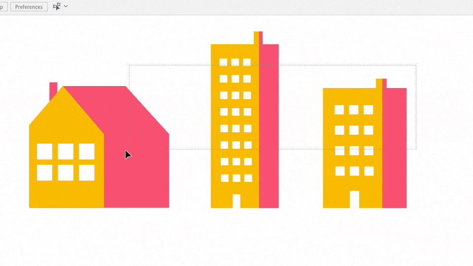 

 

## SelectOnlyPoints

After using the Lasso tool or Direct Selection Tool, both Points and Path segments are selected. 

### Usage

1. Select points on paths with Direct Selection Tool `key: A` or Lasso tool `key: Q`
2. Run script `File → Scripts → SelectOnlyPoints`
 

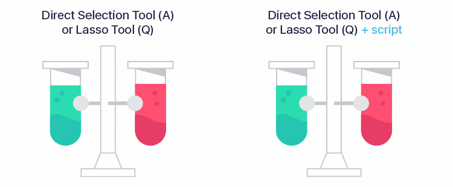 

 

## SelectPointsByType

Selects points on the selected paths according to their type. Does the thing that even Astute Graphics plugins can't do :)   
Select `View → Hide Bounding Box` to see active points in real time.

### Usage

1. Select paths with Direct Selection Tool `key: A` or Group Selection Tool
2. Run script `File → Scripts → SelectPointsByType`
3. Click the button or use keyboard shortcuts:

* Bezier `Alt+1`
* Flush `Alt+2`
* Corner `Alt+3`
* Broken `Alt+4`
* Flat `Alt+5` 

 

 

## SplitPath

Powerfull script for subtract shapes from paths. Pathfinder panel in Adobe Illustrator does not do it.   

### Usage

1. Place the closed filled shape top
2. Select shape and line
3. Run script `File → Scripts → SplitPath `
4. Select cut method in dialog box
 

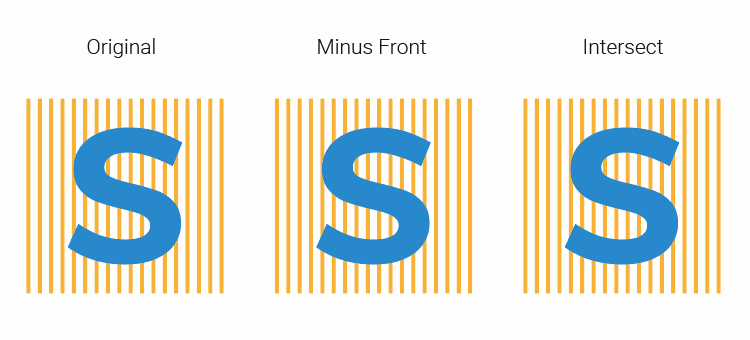 

 

## StrokeColorFromFill

Setting the Stroke color of object based on an his solid or gradient fill. The option to automatically add an stroke is not available for Mac OS users with an Illustrator older than CC 2020.   

### Usage

1. Select object(s)
3. Run script `File → Scripts → StrokeColorFromFill `
4. Enter color shift value
 

 

 

## TrimMasks

Automatic trimming of all clipping groups in selection or a document using `Pathfinder > Crop`.   
If you want to save the filled mask after trimming, open the script file in a text editor and change `SAVE_FILLED_CLIPMASK = false;` value to `true`.

### Usage

1. Select object(s) or deselect all
2. Run script `File → Scripts → TrimMasks `

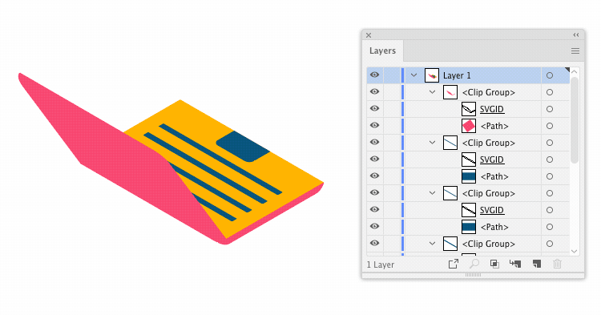 

 

## Zoom and center

Zooms active view to selection or to all object(s) in a document.   
*Based on original script by [John Wundes](http://www.wundes.com/).*

### Usage

1. Select object(s) to zoom or deselect all
2. Run script `File → Scripts → Zoom-and-center`
3. If nothing is selected, you will see a dialog with options
 

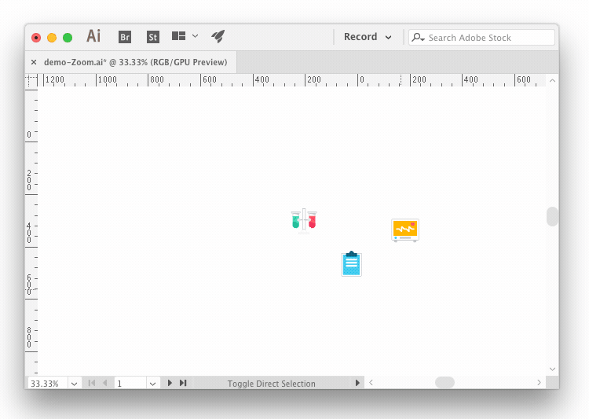 

 

## Testimonials
* Sergey, these scripts of yours are great. — Terry Foxx   
* Wow. I just installed and successfully tested. Outstanding work!!!. — Zak Lay
* Tried your script to export selected objects to separate Ai, works smartly. — Dmitry
* I looked at your post. Useful scripts!. — Askhat Gilyakhov

#### Don't forget sharing link with a friend 🙂 

## Contribute

Found a bug? Please [submit a new issues](https://github.com/creold/illustrator-scripts/issues) on GitHub.

### Contact
Email <hi@sergosokin.ru>  

### License

All scripts is licensed under the MIT licence.  
See the included LICENSE file for more details.